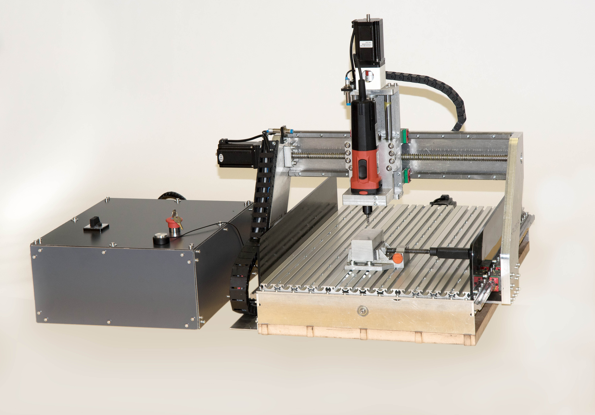

<h1 style=align="center">TseNC</h1>

<i>Open Source CNC Milling Machine</i>

TseNC specifications
--

- working area: 600x370x145mm Y-X-Z (400mm on X with no side protection)
- frame: solid aluminum plates of 6/8/12/20mm bolted
- Bed: aluminum nut profiled Nut 8
- actuators: 16mm ballscrews on X and Y, 12mm ballscrew on Z
- linear guides: Hiwin HGR15
- maximum speed: 4000mm/min
- mechanical resolution: 0.003125mm
- spindle: Mafell FM1000 1Kw
- firmware: GRBL-LPC
- controller: LPC1768 32bit
- motors: NEMA 24 4MN
- motor controllers: 3 x DM556
- compatible collets: 3/4/5/6/8mm 1/8 and 1/4
- quick spindle release
- Z zero sensor
- inductive endstops with softlimits
- side procection of 6mm POM
- emergency button with fuse protection

Author
--
Project Lead: 
Prof. Dr. William Megill
 
 
Machine design and fabrication: 
Daniele Ingrassia
 
 
Technical help and assembly: 
Leen Nijim 
Kevin Brinkmann 
 
Rhine-Waal University of Applied Sciences 
https://www.hochschule-rhein-waal.de/en

License
--

TseNC and all the work in this repository is released under the following open source license:

CERN Open Hardware Licence - Weakly Reciprocal, CERN-OHL-W
